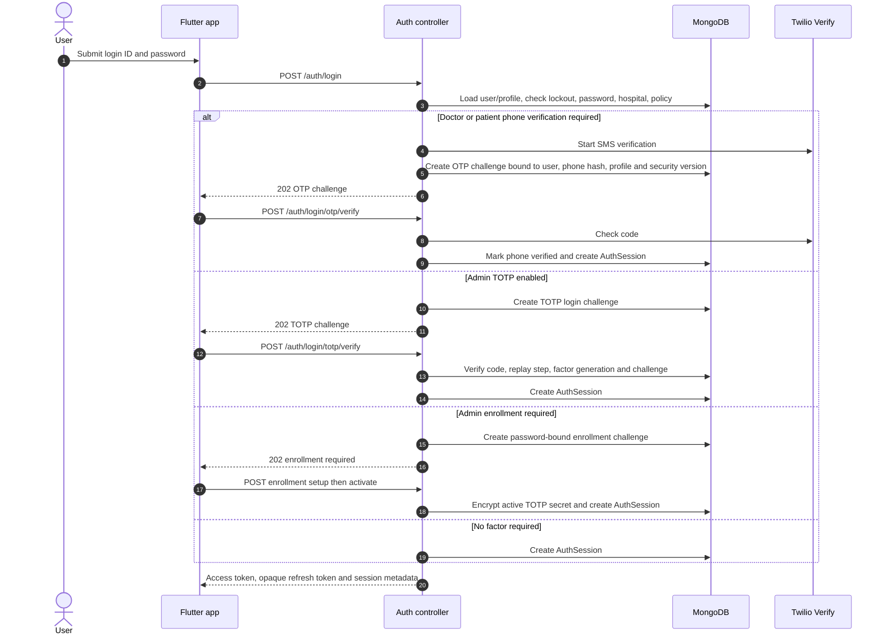
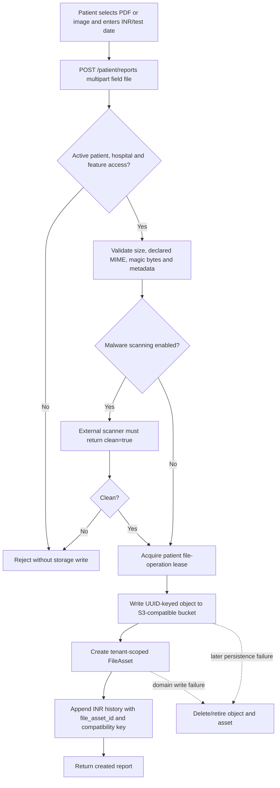
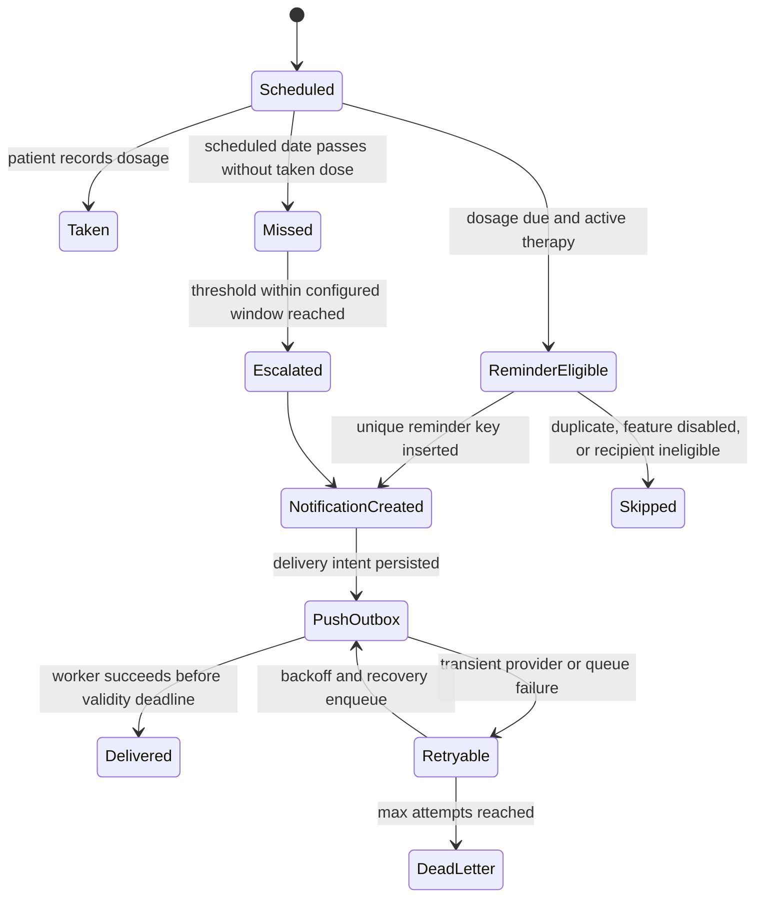
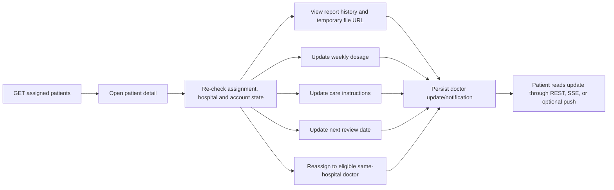
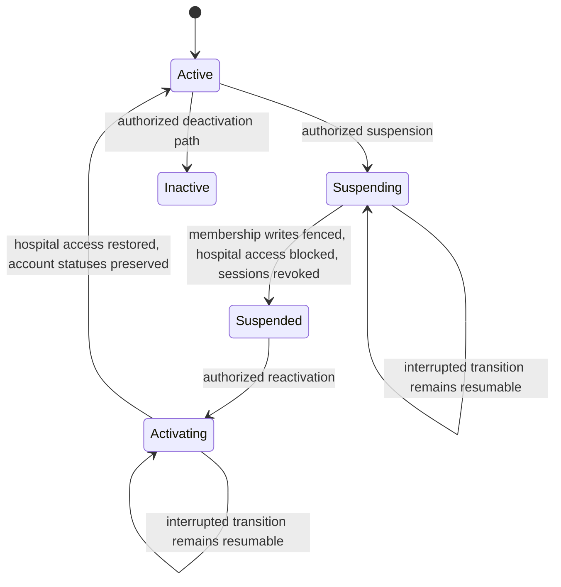
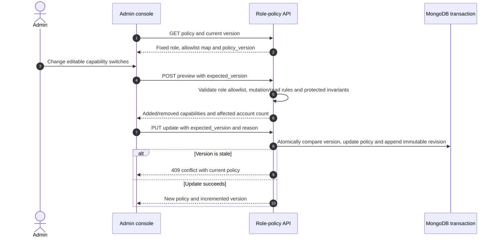
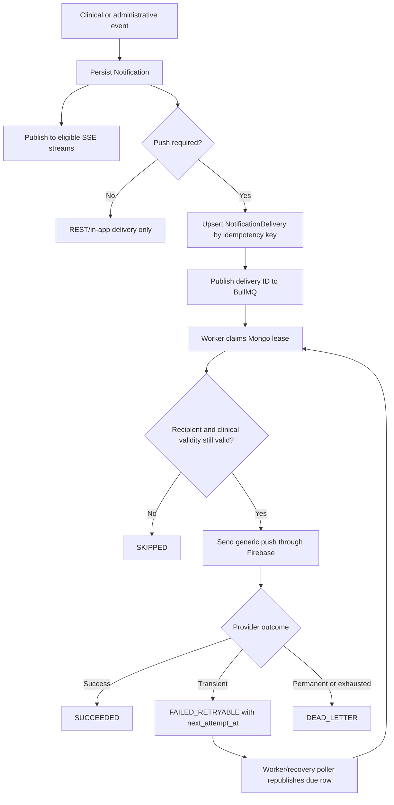
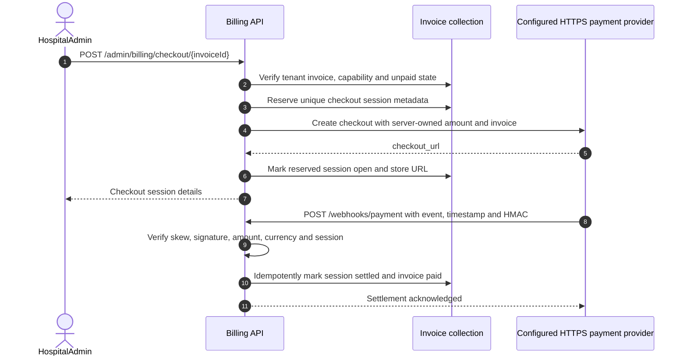
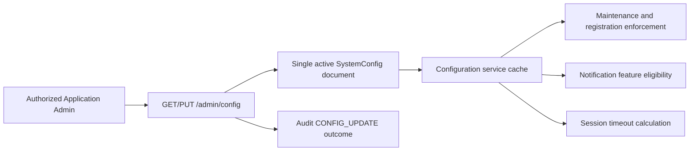

# Individual feature workflows

## Password, OTP, TOTP, and session issuance

The Flutter OTP form uses `resend_available_at`, remaining attempts, and max resends from the challenge payload. Resend stays disabled during cooldown or after the resend budget is exhausted; verify is blocked when the challenge is expired or has no attempts left.

When login returns `TOTP_ENROLLMENT_REQUIRED`, the Flutter login page loads password-bound setup material (QR code and setup key) and activates the factor with the six-digit authenticator code before a session is issued. Challenge expiry and lockout return the administrator to the password form; an invalid authenticator code stays on the enrollment form.

## Patient INR report upload

The Update INR form rejects empty, non-decimal, zero, and values above 20 before `POST /patient/reports`, matching `reportSchema`.

## Dosage adherence and reminders

## Doctor review and care-plan update

## Hospital and account lifecycle

Hospital lifecycle uses a lease and monotonic generation. Doctor lifecycle and patient assignment use related leases/fences so stale workers cannot safely resume after losing ownership.

## Administrator role-policy change

## Notification delivery

## Billing checkout and settlement

The provider brand and live endpoint are configuration, not source-backed facts.

## Runtime configuration and feature flags

### Administrator data loading states

Analytics, personal MFA, platform configuration, and hospital operations health distinguish a first-load failure from an empty result. A failed first load shows an error and an explicit retry. When a refresh fails after data loaded successfully, the page keeps that data visible, labels it as stale with its last successful load time, and shows the refresh error with a retry action. Configuration does not schedule another initial request after a failure; the administrator retries explicitly. Analytics section-level authorization denials remain distinct from request failures, and empty charts are shown only after the aggregate query succeeds.

### Lifecycle commit and recovery

Individual Doctor/Patient status routes, legacy deactivation routes, and batch activation/deactivation share one transition service. A MongoDB transaction commits `User.is_active`, `User.security_version`, patient `account_status`, and conflict-metadata cleanup. Expected account, hospital, assignment, and profile state must still match. Hospital and doctor lease documents participate in the transaction to reject superseded owners. Patient activation also excludes purged/purging profiles and requires an active same-hospital doctor. Deceased patients cannot be restored or discharged.

Transactions require a replica set. These transitions fail closed on standalone MongoDB; there is no independent-write fallback. Physical session cleanup runs after commit. `revocation_cleanup_completed: false` reports cleanup failure while the committed security version rejects old sessions.

Hospital suspension/inactivation blocks hospital access, bumps member security versions to invalidate in-flight login snapshots, and revokes existing sessions while preserving individual account and patient statuses. Reactivation restores access only for individually active accounts; users must sign in again after session revocation. Accounts disabled by earlier releases remain disabled and require explicit review before restoration. No automatic historical restoration is attempted.

### Patient management directory

The administrator patient directory shows login account status separately from clinical lifecycle status and includes the assigned doctor's display name. Its lifecycle filter includes Active, Discharged, Deceased, and AssignmentConflict; the doctor filter selects active doctors by name. Patient onboarding and reassignment use the paginated, searchable `GET /admin/doctors/assignment-options` lookup, which returns only active same-hospital doctor identity and eligibility and is authorized by `tenant.patients.manage` or `tenant.patients.assign`; the general doctor directory remains protected by `tenant.doctors.read`. AssignmentConflict is an operational quarantine: administrators with patient-assignment capability can use **Resolve assignment conflict** to reassign the patient through the guarded same-hospital assignment flow. Successful reassignment clears conflict metadata and returns the lifecycle status to Active. Deceased patients cannot be reassigned, reactivated, or discharged. AssignmentConflict patients cannot be activated until reassignment repairs the assignment.

### Maintenance recovery

The exact `/admin/access/me` bootstrap and `/admin/config` endpoints remain reachable during maintenance along with authentication, password/MFA recovery bootstrap, and health endpoints. Their normal authentication and authorization still apply. An Application Admin can sign in again, reload access, open configuration, and disable maintenance. Tenant application routes remain unavailable.

## Administrator account and one-time credential dialogs

Administrator invite and edit forms validate before submission, disable their controls during the request, and keep the dialog open until the request succeeds or fails. An edit that changes role or hospital scope previews the old and proposed access and warns that the administrator's active sessions will be revoked. After a successful edit, the page confirms completion and refreshes the account list. A successful invite presents any temporary password before refreshing the list, so a refresh failure cannot hide the one-time credential.

Doctor registration, patient onboarding, and administrator invitation show a one-time password in a result dialog when the API returns one. The operator must acknowledge that they recorded it for secure delivery before Done is enabled. Outside taps cannot dismiss these result dialogs. A missing temporary password is reported as successful creation without inventing a credential.
